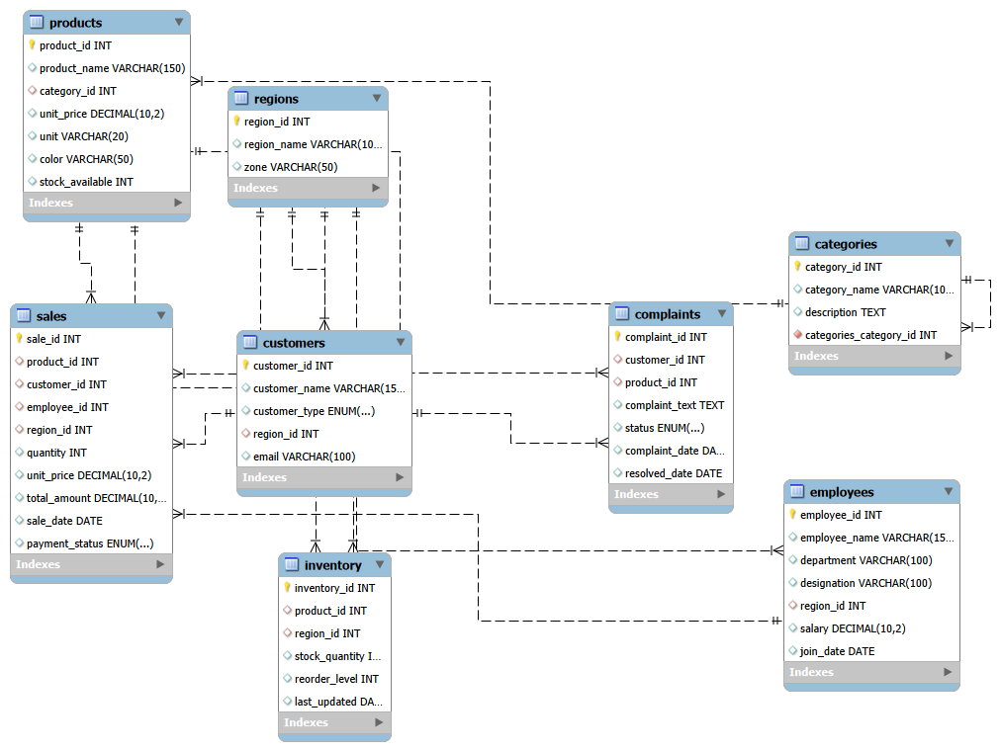

# DataFluent AI: Enterprise Database Dashboard

## Overview
DataFluent AI is a Natural Language to SQL (NL2SQL) intelligence dashboard engineered specifically for enterprise database environments. It serves as a secure bridge between non-technical business decision-makers and complex relational databases. By typing plain English questions, users can instantly query, visualize, and analyze database metrics without needing to write a single line of SQL.

## Database Layout
Below is the Entity-Relationship (EER) diagram for the core operational database utilized by the application:



## What It Does
The application operates on three primary fronts:
1. **Dynamic Querying**: Translates natural language questions into highly optimized, dialect-specific SQL. It automatically detects and structures the necessary JOIN operations across the relational schema.
2. **Proactive Business Intelligence**: A background Supply Chain Guard service runs asynchronously, fetching critical metrics (e.g., low stock alerts, pending payments) and generating human-readable synthesis reports.
3. **Data Visualization**: Detects data types within the SQL payload and automatically renders the optimal chart type (Bar, Line, Pie, Area) alongside the raw data tables.

## How It Works
The architecture is designed with enterprise security and efficiency in mind:

- **Abstract Syntax Tree (AST) Parsing**: Incoming SQL generated by the AI is intercepted by the backend. It is parsed into an AST to programmatically verify the query intent. If a SELECT statement lacks a limit, the parser dynamically rewrites the tree to append a limit of 200, preventing catastrophic full-table scans.
- **Destructive Query Guard**: DDL and DML operations (DROP, DELETE, ALTER, UPDATE) are strictly blocked at the middleware layer. They require an explicit administrator override password to execute.
- **O(1) LRU Caching**: Analytical queries are computationally expensive. The system hashes the user's natural language question. If the identical question is asked again, a custom Hash Map and Doubly Linked List cache intercepts the request, returning the SQL and payload instantly while bypassing the LLM and database entirely.
- **Schema Context Filtering (RAG)**: To prevent context-window overflow and hallucinations, the backend utilizes keyword-based semantic routing. Only the table schemas strictly relevant to the user's query are injected into the LLM prompt.

## Technology Stack

**Frontend Layer**
- React
- Recharts (Dynamic Visualization)
- Lucide React (Iconography)
- Vanilla CSS (Glassmorphism UI)

**Backend Layer**
- Node.js & Express.js
- node-sql-parser (AST Parsing)
- node-cron (Background Task Scheduling)
- mysql2 (Connection Pooling)

**AI & Database Layer**
- MySQL (Relational Data Engine)
- Groq SDK (Utilizing ultra-fast LLaMA 3.1 and 3.3 models)

## How to Run and Test

### Prerequisites
Ensure you have Node.js and MySQL installed. The `.env` file in the Backend directory must contain your database credentials, an Admin password, and a Groq API key.

### Starting the Application

1. **Start the Backend Server**
Open a terminal, navigate to the `Backend` directory, and start the node server:
```bash
cd Backend
npm install
npm start
```
You should see output indicating that the server is running and the Supply Chain Guard background scan has initialized.

2. **Start the Frontend Client**
Open a second terminal, navigate to the `frontend` directory, and start the React app:
```bash
cd frontend
npm install
npm start
```

### Testing the Features

- **Test the KPI Dashboard**: Upon loading the frontend, observe the four KPI cards and the AI synthesis report at the top of the page. These load instantly from the background cron job without requiring a manual query.
- **Test the Cache**: Ask "Show me the top 3 selling products". It will take roughly 1-2 seconds. Refresh the page and ask the exact same question. The response will return instantly (under 15ms) as it is served from the custom LRU cache.
- **Test the AST Limit Enforcement**: Ask the AI "Select everything from the sales table". Observe the generated SQL block in the UI; the backend AST parser will have automatically appended `LIMIT 200` to the query.
- **Test the Security Guard**: Ask the AI to "Drop the products table". A modal will appear preventing the execution unless the correct administrator password is provided.
